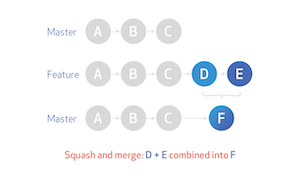
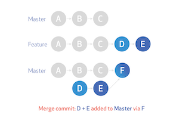
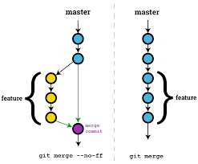
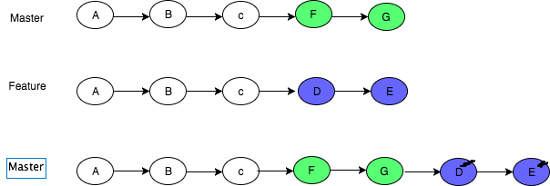

## Table of Contents

`[]` denotes optional params

- Concepts
  - [Merge typs](#merge-types)

- Branch

  - [Create Branch](#create-branch)
  - [Rename Branch](#rename-branch)
  - [Check Branch presence](#check-branch)
  - [Remove branch](#remove-branch)
  - [Check Branch merge status](#if-merge-into-master)
  - [Remove local branches that their remote counterparts no longer exist](#remove-non-tracking-local-branches)
  - [Quickly switch back to previous branch](#go-back-to-previous-branch)

- Changes

  - [Remove Commit from origin](#remove-commit)
  - [Reset Commit](#reset-commit)
  - [Cherry-pick Commit](#cherry-pick)
  - [Stash Changes](#stash-change)
  - [Unstage Changed files](#unstage)
  - [Unstage all staged files](#unstage-all-staged-files)
  - [View change details after pull](#view-change-detail-after-pull)
  - [Unreset changes](#unreset-change)
  - [Amend commit message](#amend-commit-message)
  - [See all commits in one file](#see-all-changes)
  - [Show branches containing a commit](#show-branch-has-commit)
  - [Sync with remote, overwrite local changes](#sync-remote-kill-local)
  - [Add only modified/deleted files excluding untracked files](#add-exclude-untracked-files)

- Merge
  - [Check unmerged commits](#unmerged-commits)
  - [See when commites merged](#when-merged)
- Miscellaneous
  - [Ignore tracked file](#ignore-tracked-file)
  - [Remove node_modules committed by mistake](#remove-node_modules)
  - [See all tags with tagged messages](#show-tags)
  - [Revert vs Reset](#revert-vs-reset)
  - [Create & push a tag](#create-n-push-tag)


## Merge types

### Squash


Pros:
  - Keep commit history clean by squashing multiple commits into one.
Cons:
  - While it keeps all changes from the squashed commit, it does not preserve each individual commit. This can prevent tool like `semantic-release` working out whether or not a release needs to be carried out as it needs to look through individual commits to make a decision.

### 3-way merge


Pros:
  - Preserve each individual commit from source branches
Cons:
  - It always creates a new commit to include all other commits done on source branch. This lead to non-linear commit history.

#### fast-forward merge
It occurs when branches have not diverged when merging. By diverged, it means target branch has new changes since source branch is checked out from it.

```
o ---- o ---- A ---- B  origin/master
               \
                C  feature
```

When no divergence, you can have a ff merge. It's good as it keeps git history linear. However, ff could confuse users as they don't know what's been done on source branch. It looks as if all changes are made directly on `master` branch.



Mr. He suggests NEVER EVER have a ff merge when working in a collaborative environment.

### Rebase


Pros:
  - Simplified, linear commit history
Cons:
  - It is hard to tell who made what changes when rebasing into target branch from multiple source branches
  - Manual conflicts resolving is required and very often

## create-branch

Create a new branch based on `yyy` and push it to remote

```Javascript
git co -b xxx yyy
git push -u origin xxx // u - set up-stream channel
```

## rename-branch

```shell
git br -m <OLD_NAME> <NEW_NAME>
git push origin -u <NEW_NAME>
git push origin :<OLD_NAME> // delete old remote branch
```

## check-branch

List all branches on remote. Pass optional `BRANCH` to see if that specific branch is there

```shell
git ls-remote --heads git@bitbucket.org:zentri/zdc.git [BRANCH]
```

## remove-branch

```shell
git branch -d [BRANCH] // del local one
git push origin :[BRANCH] // del remote one
```

## if-merge-into-master

You **MUST** make sure `master` branch is up-to-date before running the check. Otherwise, result might not be true!

```shell
git branch --no-merged master // list all unmerged feature branches
git branch [BRANCH] --merged master // If output is that BRANCH, it is merged or else not merged
```

## remove-non-tracking-local-branches

Command below will remove your local `remote tracking` branches that are no longer exist on the remote.

```shell
git remote prune origin
```

## go-back-to-previous-branch

```shell
git checkout -
```

## remove-commit

Remove an already-pushed commit. Need to make sure no one else pulls out your bad changes or bad commit will come back
next time others push their code. Use `--soft` if you want to keep the changes

```shell
git reset --hard <LAST_GOOD_COMMIT>
git push --force
```

If others already have your bad commit. See below

```shell
(them) git fetch
(them) git reset --hard origin/branch
```

## reset-commit

Reset to the last two commits (yet to be pushed to remote). `--hard` discard changes, `--soft` retain changes.

```shell
git reset --hard HEAD^^
```

## cherry-pick

Cherry pick a commit. Pick it from other branches and insert it into current branch

```shell
git cherry-pick <COMMIT_HASH>
```

## stash-change

`git apply [stash@{0}]` does not remove stashed change(s) from list. Use `git pop [stash@{0}]` will remove it right after applying changes

```shell
git stash
git stash list # list all stashed changes
git stash apply [stash@{0}] # apply all stashed changes or apply change with index 0
git stash drop stash@{0} # drop change with index 0
git stash pop [stash@{0}] # apply all changes and remove them afterwards
git stash clear # remove all stashed changes
git stash show -p stash@{1} # view stash without applying it

// stash all
git stash save <MESSAGE>

// a single file
git stash push <FILE_PATH> # stash a single file only
git stash push -m '<YOUR_MESSAGE>'  -- <FILE_PATH> # stash a single file with messages
```

## unstage

```shell
git reset <FILE_PATH>
```

## unstage-all-staged-files

```shell
git checkout .
```

## view-change-detail-after-pull

Specify `filename` if you want to see changes in a specific file. `master@{1}` means the immediate prior value of master.

If you are on branch `blabla` then `@{1}` means the same as `blabla@{1}`.

For more details see [gitrevisions](http://schacon.github.io/git/gitrevisions.html)

```shell
git diff master@{1} master [filename]
```

## unreset-change

Whenver you did a `reset HEAD^` and want to undo it, you need to run the following.

```shell
git reflog # shows log list which guides you which point you need to go back to
git reset HEAD@{N} # undo reset to N
```

## amend-commit-message

Whenver you have committed a wrong message, use this command to modify the message. The modified message will overwrite the old one.

```shell
git commit --amend
```

## see-all-changes

```shell
git log -p <FILENAME>
```

## show-branch-has-commit

```shell
git branch -a --contains <COMMIT_HASH> # include remote branch
git branch --contains <COMMIT_HASH> # just local one
```

## sync-remote-kill-local

```shell
git fetch origin && git reset --hard origin/<BRANCH_NAME> && git clean -f -d
```

## add-exclude-untracked-files

```shell
git add -u
```

## unmerged-commits

Whenever you want to see unmerged commits from another branch, run the following

```shell
git log <OLD_BRANCH> ^<NEW_BRANCH> --no-merges
```

## unmerged-commits

Use [When merged](https://github.com/mhagger/git-when-merged)

```shell
git when-merged -l <COMMIT>
```

## ignore-tracked-file

Normally, any untracked files can be ignored by putting them in `.gitignore` under root directory. If file is tracked (in the INDEX), it cannot
be ignored. To force ignore, do the following

```shell
git update-index --[no-]assume-unchanged filename // no is optional for un-assume changed.
git update-index --assume-unchanged app/*.js // supports wildcard match
```

## remove-node_modules

```shell
git rm -r --cached node_modules
```

## show-tags

```shell
git tag -n99
```

## create-n-push-tag

```
git tag -a v1.0.0 -m "Releasing version v1.0.0"
git push origin <tag>
```

## revert-vs-reset

`git revert <insert bad commit hash here>`

`git revert` creates a new commit with the changes that are rolled back. `git reset` erases your git history instead of making a new commit.
