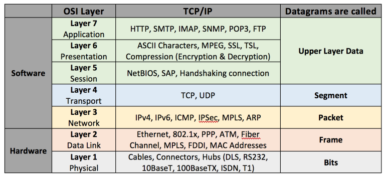
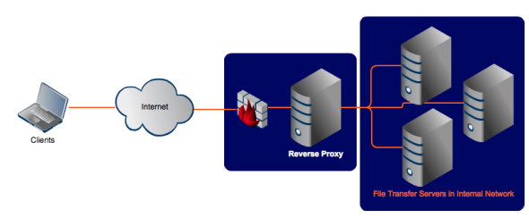
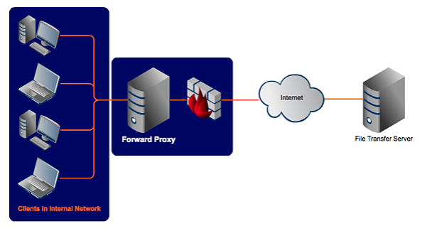

## Networking

- [HTTP, SSL/TLS](<./http(s).md>)
- [OSI](#osi)
- [Web Caching](./web_caching.md)
- [SSH](./ssh.md)
- [DNS](#dns)
  - [DNS Resolution workflow](#dns-resolution-flow)
  - [DNS TTL](#dns-ttl)
  - [www domain and naked domain](#www-vs-naked)
  - [Route53 Alias record vs CNAME record](#alias-record-vs-cname-record)
- [nc(telnet) on Mac](#nc)
- [Ephemeral Ports](#ephemeral-ports)
- [DNS records](#dns-records)
- [NAT](#nat)
- [Network interface and Virtual Network Interface](#network-interface)
- [IP, CIDR, network masking](#ip-cidr-network-masking)
- [0.0.0.0](#wildcard-ip)
- [Forward Proxy and Reverse Proxy](#forward-proxy-and-reverse-proxy)
  - [Load Balancing](#load-balancing)
- [Server Name Indication](#sni)
- Tips
  - [Connection Problems](#connection-problem)
  - [HTTPS or HTTP](#https-or-http)

### OSI

- tcp/udp port is at layer 4 (transport layer)
- ping(icmp) is at network layer. It does not use port
- A socket is the combination of IP address plus port



### DNS

2 kinds of DNS servers: recursive DNS servers aka DNS resolver AND authoritative DNS servers aka nameservers.

[DNS explained in detail](https://jvns.ca/blog/how-updating-dns-works/)

#### dns-resolution-flow

- 
- 
- [DNS Resolution explained in Chinese](https://blog.csdn.net/crazw/article/details/8986504)
- Given url `https://www.ABC.com`:
  - `com` is Top-level Domain aka (TLD)
  - `ABC` is Root(Second-level) Domain aka (SLD)
  - `www` is Subdomain(third-level domain)
  - `http` is the protocol with TLS/SSL

#### DNS TTL

- 简单的说，TTL就是一条域名解析记录在DNS服务器(aka recursive DNS servers or DNS resolver)中的存留时间。当各地的DNS服务器接受到解析请求时，就会向域名指定的NS服务器发出解析请求从而获得解析记录；在获得这个记录之后，记录会在DNS服务器中保存一段时间，这段时间内如果再接到这个域名的解析请求，DNS服务器将不再向NS服务器发出请求，而是直接返回刚才获得的记录，而这个记录在DNS服务器上保留的时间，就是TTL值.
- Some recursive DNS servers definitely don’t respect TTLs, even if the major ones like 8.8.8.8 do.

#### www-vs-naked

- From SEO point of view, some search engine recognize `www` and `non-www` as two different web sites and this cause to penalize the domain considering website has duplicate contents.

#### alias-record-vs-cname-record

`alias` record is similar to a `CNAME` record, except you can create an alias record both for the `root domain - example.com` and for `subdomains - www.example.com` whereas you can create `CNAME` records only for subdomains.

Note, `CNAME` only points the source domain to the destination domain, which they both have the same ip address. In other words, traffic targeting source domain will now be routed to destination domain. However, you cannot see the redirection in the browser, since `DNS` itself does not provide redirection capability. You have to do that at the web server level. i.e using `nginx`.

### nc

Use `nc` as you would with `telnet`:

```js
$ nc -v https://xyz.com 443
```

Here are some troubleshooting tips:

if you receive `Connection refused` as the response, chances are your EC2 instance does not have a web server running.
Likewise, you will see `This site cannot be reached` when trying to access your EC2 instance from `chrome` via EC2 public ip.

### ephemeral-ports

It is a range of ports your clients randomly choose one from for a connection with the server. By using this, client will listen on that port for any traffic coming back from connected servers.

The range varies depending on different OS. For instance, Windows operating systems through Windows Server 2003 use ports `1025-5000`. Windows Server 2008 and later versions use ports `49152-65535`.

Let's say your client (your machine) initiates a `ssh` connection with a remote server.

`192.168.1.102:37852 ---> 233.200.177.122:22`

`37852` is the randomly-picked port number by your OS for communications. Since it's random, that's why you need to specify ephemeral port range when defining inbound/outbound traffic rules in NACL. i.e in order for your server to respond to connected client (Windows XP Client) on random ports between `1025-5000`, you must have to enable outbound traffic destined for ports `1025-5000`.

### dns-records

#### CNAME

| (sub)Domain/Hostname | Record Type | Target/Destination |
| -------------------- | :---------: | -----------------: |
| mydomain.com         |      A      |    111.222.333.444 | mydomain.com |
| www.mydomain.com     |    CNAME    |       mydomain.com |
| ftp.mydomain.com     |    CNAME    |       mydomain.com |
| mail.mydomain.com    |    CNAME    |       mydomain.com |

Say you have several domains all want to point to `mydomain.com`. Benefit of this design allows you only need to change once when `mydomain.com` ip address is changed.

One usecase for `CNAME` is - you want domains registered in AU `mydomain.com.au` and NZ `mydomain.com.nz` both to be redirected to `mydomain.com`.

### MX

>>>
MX记录 MX（Mail Exchanger）记录是邮件交换记录，它指向一个邮件服务器，用于电子邮件系统发邮件时根据收信人的地址后缀来定位邮件服务器。例如，当Internet上的某用户要发一封信给user@mydomain.com 时，该用户的邮件系统通过DNS查找mydomain.com这个域名的MX记录，如果MX记录存在， 用户计算机就将邮件发送到MX记录所指定的邮件服务器上


### NAT


### wildcard ip

In the context of servers, `0.0.0.0` means all IPv4 addresses on the local machine. If having a server running on a host listen for wildcard ip, it basically means the server can be accessible from any devices within the same network as the host.
i.e

```js
$ HOST=0.0.0.0 react-scripts start // make app server accessible to any devices on the network
// or another way of saying this is app server will listen on all network interfaces for coming traffic and handle them
$ HOST=localhost react-scripts start // make app server only accessible from the host
```

When considering wildcard ip in the context of security group and set `source` to wildcard ip in `inbound` rules, it means the instance is reachable by everyone or in other words instance accpets connection from everyone. Similarly, when set `destination` to wildcard ip in `outbound` rules, it means all traffic is allowed to go out.

### Network Interface

- Network interface - It allows your host to connect to the network. **eth0** is the network interface name which can also be seen as your host IP address.
- Virtual Ethernet Devices - A virtual ethernet device or veth is a Linux networking interface that acts as a connecting wire between two network namespaces. A veth is a full duplex link that has a single interface in each namespace. Traffic in one interface is directed out to the other interface.

### IP CIDR network-masking

Given `192.168.1.0/28`, it tells us the following:

- mask is `255.255.255.240` or `11111111 11111111 11111111 11110000` when represented in binary.
- 14 available ips - from `00000001` to `00001110` that is `192.168.1.1` as the first ip and `192.168.1.14` as the last ip.
  Note, `192.168.1.0` and `192.168.1.15` are reserved and cannot be used.
- Given `10.0.1.127/25` that is represented in binary as `00001010 00000000 00000001 0(1111111)`, the first ip is `10.0.1.1` and last ip is `10.0.1.126`.
- Given `10.0.1.128/25` with last range being `1(0000000)`, the first ip is `10.0.1.129` and last ip is `10.0.1.254`.

### Forward Proxy and Reverse Proxy

Both setups aim to protect your servers/clients by enforcing security rules (firewall) on proxy servers.

- Reserve Proxy is used when you want to protect your fleet of servers which respond to clients' request.


- Forward Proxy is used when clients from inside internal network need to reach out to the servers on the internet. In other words, clients initiate the connections. Note the difference compared to Reverse Proxy where clients on the internet initiate the connection request.


[Read more](https://www.jscape.com/blog/bid/87783/forward-proxy-vs-reverse-proxy)

#### Load Balancing

L7-LB
  - Implemented as software. Frequent updates
  - Packets manipulations i.e HTTP HEADERs/logging/SSL termination. they all cause overhead
  - CA can be installed on it for SSL termination
  - Sticky session capability
  
L4-LB
  - Little manipulation to packets
  - Fast
  - Inability to decode packets. So unable to distinguish between HTTP/HTTPS/FTP

[TCP VS HTTP(S) Load Balancing](https://medium.com/martinomburajr/distributed-computing-tcp-vs-http-s-load-balancing-7b3e9efc6167)

### SNI

The problem is, all these hostnames on one server are at the same IP address. This isn't a problem over HTTP, because as soon as a TCP connection is opened the client will indicate which website they're trying to reach in an HTTP request.

But in HTTPS, a TLS handshake takes place first, before the HTTP conversation can begin (HTTPS still uses HTTP – it just encrypts the HTTP messages). Without SNI, then, there is no way for the client to indicate to the server which hostname they're talking to. As a result, the server may produce the SSL certificate for the wrong hostname. If the name on the SSL certificate does not match the name the client is trying to reach, the client browser returns an error and usually terminates the connection.

SNI adds the domain name to the TLS handshake process, so that the TLS process reaches the right domain name and receives the correct SSL certificate, enabling the rest of the TLS handshake to proceed as normal.

Specifically, SNI includes the hostname in the Client Hello message, or the very first step of a TLS handshake.

---

### Connection Problem

- `connection timeout` port not opened or blocked by firewall
- `connection refused` port is reachable but service is down/not listening on that port

```shell
# will list what services listening on which port
$ netstat -tulpn
```

### HTTPs or HTTP

If all hosts involved are running within the same network trust boundary, it's ok to have http connections between any 2 of them. If it is not the case however, HTTPS must be used to prevent man-in-the-middle attacks. i.e communication between 2 instances on the same vpc can allow http whereas browser-n-server communication must take place over HTTPS.
