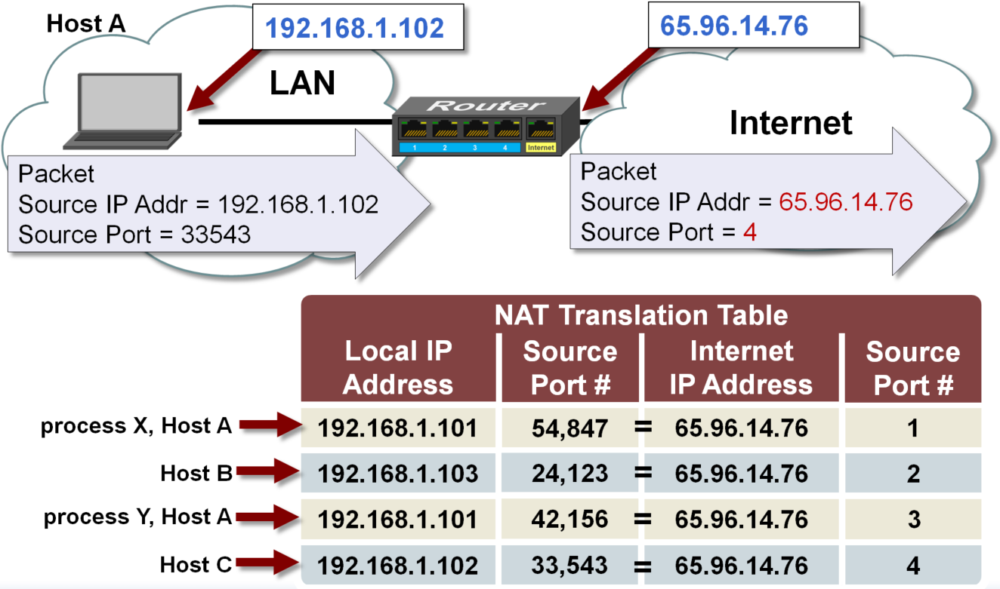

## Networking

- [HTTP, SSL/TLS](<./http(s).md>)
- [Web Caching](./web_caching.md)
- [SSH](./ssh.md)
- [DNS](#dns)
  - [DNS Resolution workflow](#dns-resolution-flow)
  - [www domain and naked domain](#www-vs-naked)
  - [Route53 Alias record vs CNAME record](#alias-record-vs-cname-record)
- [nc(telnet) on Mac](#nc)
- [Ephemeral Ports](#ephemeral-ports)
- [CNAME record](#cname)
- [NAT](#nat)
- [IP, CIDR, network masking](#ip-cidr-network-masking)
- [0.0.0.0](#wildcard-ip)
- [Forward Proxy and Reverse Proxy](#forward-proxy-and-reverse-proxy)
- [OSI model](#osi-model)

### dns-resolution-flow

- 
- 
- [DNS Resolution explained in Chinese](https://blog.csdn.net/crazw/article/details/8986504)
- Given url `https://www.ABC.com`:
  - `com` is Top-level Domain aka (TLD)
  - `ABC` is Root(Second-level) Domain aka (SLD)
  - `www` is Subdomain(third-level domain)
  - `http` is the protocol with TLS/SSL

### www-vs-naked

- From SEO point of view, some search engine recognize `www` and `non-www` as two different web sites and this cause to penalize the domain considering website has duplicate contents.

### alias-record-vs-cname-record

`alias` record is similar to a `CNAME` record, except you can create an alias record both for the `root domain - example.com` and for `subdomains - www.example.com` whereas you can create `CNAME` records only for subdomains.

Note, `CNAME` only points the source domain to the destination domain, which they both have the same ip address. In other words, traffic targeting source domain will now be routed to destination domain. However, you cannot see the redirection in the browser, since `DNS` itself does not provide redirection capability. You have to do that at the web server level. i.e using `nginx`.

### nc

Use `nc` as you would with `telnet`:

```js
$ nc -v https://xyz.com 443
```

Here are some troubleshooting tips:

if you receive `Connection refused` as the response, chances are your EC2 instance does not have a web server running.
Likewise, you will see `This site cannot be reached` when trying to access your EC2 instance from `chrome` via EC2 public ip.

### ephemeral-ports

It is a range of ports your clients randomly choose one from for a connection with the server. By using this, client will listen on that port for any traffic coming back from connected servers.

The range varies depending on different OS. For instance, Windows operating systems through Windows Server 2003 use ports `1025-5000`. Windows Server 2008 and later versions use ports `49152-65535`.

Let's say your client (your machine) initiates a `ssh` connection with a remote server.

`192.168.1.102:37852 ---> 233.200.177.122:22`

`37852` is the randomly-picked port number by your OS for communications. Since it's random, that's why you need to specify ephemeral port range when defining inbound/outbound traffic rules in NACL. i.e in order for your server to respond to connected client (Windows XP Client) on random ports between `1025-5000`, you must have to enable outbound traffic destined for ports `1025-5000`.

### cname

| (sub)Domain/Hostname | Record Type | Target/Destination |
| -------------------- | :---------: | -----------------: |
| mydomain.com         |      A      |    111.222.333.444 | mydomain.com |
| www.mydomain.com     |    CNAME    |       mydomain.com |
| ftp.mydomain.com     |    CNAME    |       mydomain.com |
| mail.mydomain.com    |    CNAME    |       mydomain.com |

Say you have several domains all want to point to `mydomain.com`. Benefit of this design allows you only need to change once when `mydomain.com` ip address is changed.

One usecase for `CNAME` is - you want domains registered in AU `mydomain.com.au` and NZ `mydomain.com.nz` both to be redirected to `mydomain.com`.

### NAT



### wildcard ip

In the context of servers, `0.0.0.0` means all IPv4 addresses on the local machine. If having a server running on a host listen for wildcard ip, it basically means the server can be accessible from any devices within the same network as the host.
i.e

```js
$ HOST=0.0.0.0 react-scripts start // make app server accessible to any devices on the network
$ HOST=localhost react-scripts start // make app server only accessible from the host
```

### IP CIDR network-masking

Given `192.168.1.0/28`, it tells us the following:

- mask is `255.255.255.240` or `11111111 11111111 11111111 11110000` when represented in binary.
- 14 available ips - from `00000001` to `00001110` that is `192.168.1.1` as the first ip and `192.168.1.14` as the last ip.
  Note, `192.168.1.0` and `192.168.1.15` are reserved and cannot be used.

Another example - `172.16.0.0/12` will have `172.16.0.0` to `172.31.255.255` as the ip range considering reserved ones as well.

### Forward Proxy and Reverse Proxy

Both setups aim to protect your servers/clients by enforcing security rules (firewall) on proxy servers.
Reserve Proxy is used when you want to protect your fleet of servers which respond to clients' request.
Forward Proxy is used when clients from inside internal network need to reach out to the servers on the internet. In other words, clients initiate the connections. Note the difference compared to Reverse Proxy where clients on the internet initiate the connection request.

[Read more](https://www.jscape.com/blog/bid/87783/forward-proxy-vs-reverse-proxy)

### OSI model

- tcp/udp port is at layer 4 (transport layer)
- ping(icmp) is at network layer. It does not use port
- A socket is the combination of IP address plus port


