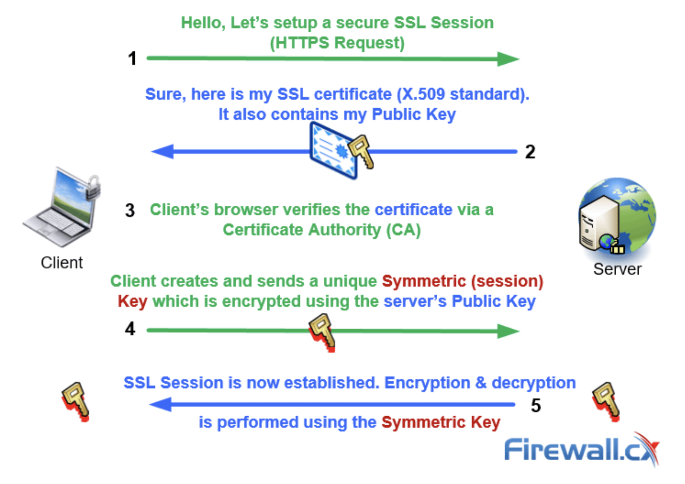

## SSL/TLS

* [SSL Cert with Let's encrypt](#Ssl-cert-with-lets-encrypt)
* [HTTP/2](#http/2)

### Ssl cert with Let's encrypt

* The objective of Let’s Encrypt and the ACME protocol is to make it possible to set up an HTTPS server and have it automatically obtain a browser-trusted certificate, without any human intervention. This is accomplished by running a certificate management agent on the web server.
* There are two steps to this process. First, the agent proves to the CA that the web server controls a domain (DNS challenge). Then, the agent can request, renew, and revoke certificates for that domain.

Certbot is a very popular agent.

***

### HTTP/2
* Multiplexing
  * With HTTP/1.1, you can only download one resource at time. When your site needs two resources `a.css` and `b.js`, a needs to be downloaded first
    before connection to download b can be established. It is really inefficient since client and server don't do too much.
  * To mitigate this, browsers allow for opening multiple connections (typically 6-8) to download them simultaneously. But there is cost involved - setup/manage multiple connections which impact both client and browser.
  * With HTTP/2, it allows you to send off multiple requests on the **same** connection. The requested resources are fetched in parallel and received
    **in any order**.
  * Note, HTTP/1.1 has a concept of `pipelining` which also allows multiple requests to be sent off at once but they need to be returned **in the order they were requested**. This feature is nowhere near as good as HTTP/2 so it is hardly used.

