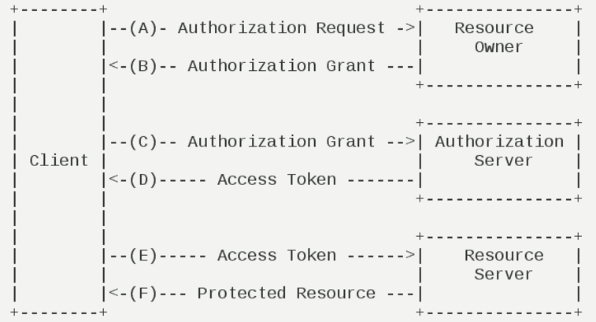

## OAuth2

### Key Points

* Four participants
  * Resource Owner - User
  * Resource Server - Google i.e Google Calendar
  * Authorization Server - Authenticate user credentials and gain user **access_token**
  * Client - 3rd party app i.e lendi
* **Resource Server** and **Authorization Server** can be the same server
* Full workflow
  1. **Client** sends request to **Resource Owner** for authorization. The OAuth **Client** includes its identifier, requested scope, local state, and a redirection URI.
  2. **Resource Owner** grants the access and sends the authorization code back to **Client**
  3. **Client** passes the authorization code to **Authorization Server**
  4. **Authorization Server** authenticates the code and sends **access_token** back to **Client**
  5. **Client** can then use **access_token** to get access to resources on the **Resource Server**
* In offline mode, **Authorization Server** also sends a **refresh_token** which is used later to exchange for another fresh **access_token** after previous one is expired without needing to go through all the steps again.

