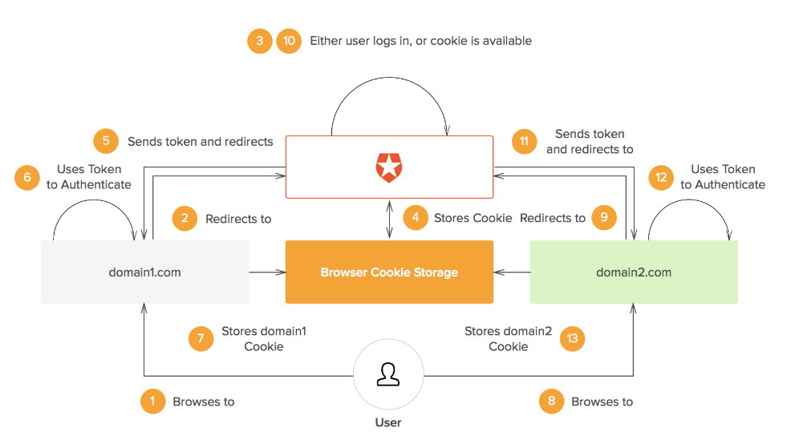

## Techs & Terms

* [Premature Optimization](#premature_optimization)
* [WebAssembly](#web-assembly)
* [HTTP/2](#http/2)
* [JWT](#jwt)
* [SSO](#sso)
* [CORS](#cors)
* [OAuth2](#oauth2)

### premature_optimization
Any coding practice that makes your code harder to understand in the name of performance is a `premature optimization`.

***

### web-assembly
* It's a new kind of code that can be compiled (ahead of time) down into a binary format that browsers can read. This means that high-level languages (C, C++) can be compiled down into a format that is legible to the browser. For developers that want to do some heavy computing on the web, this is a huge plus.
* At the time of writing, it does not support `DOM access` - so JS is still needed.

***

### HTTP/2
* Multiplexing
  * With HTTP/1.1, you can only download one resource at time. When your site needs two resources `a.css` and `b.js`, a needs to be downloaded first
    before connection to download b can be established. It is really inefficient since client and server don't do too much.
  * To mitigate this, browsers allow for opening multiple connections (typically 6-8) to download them simultaneously. But there is cost involved - setup/manage multiple connections which impact both client and browser.
  * With HTTP/2, it allows you to send off multiple requests on the **same** connection. The requested resources are fetched in parallel and received
    **in any order**. Interleave (send in arbitrary order) multiple requests/responses in parallel.
  * Note, HTTP/1.1 has a concept of `pipelining` which also allows multiple requests to be sent off at once but they need to be returned **in the order they were requested**. This feature is nowhere near as good as HTTP/2 so it is hardly used.

***

### JWT

#### Basics

* JWT is comprised of 3 parts - **xxxx.yyyyy.zzzz** = **header**.**payload(claim)**.**signature**
* header is as follow. It shows the algorithm we use to generate the signature. It needs to be base64 encoded.
```js
{
  "typ": "JWT",
  "alg": "HS256"
}
```
* payload(claim) contains metadata as follow. It then base64 encoded.
```js
{
  "iss": "Mr He. JWT", // issuer
  "iat": 1441593502, // issued at
  "exp": 1441594722, // expire at
  "aud": "www.lendi.com.au", // audience - server
  "sub": "david.he@lendi.com" // subject - client
}
```
* signature is generated by joining the above two base64 encoded strings first and then encrypted with secret - 'I love this game'.
```js
signature = header_alg(xxxxxxx.yyyyyyyy, YOUR_SECRET)
```

#### Key Notes

* Never ever put the senstive data in **header** and **payload** - they are encoded not encrypted!!!
* Why do we need signature? - It prevents somebody modifying the data.
* How does server do the authentication? - Server will use the specified algorithm in the header, secret stored on the server, **header** and **payload** to generate another signature. Then, server will do the comparison with the sent one if they don't match it indicates the token has been tampered with.

***

### SSO

* [What is SSO and how it works](https://auth0.com/blog/what-is-and-how-does-single-sign-on-work/)
* [keypoints](#keypoints)

#### keypoints
* Users will always be redirected to `Auth` server where sent `cookie` will be checked to determine whether or not users need to authenticate or redirect.
* In case of unauthenticated visists When they are visiting `abc.domain.com`, `Auth` server will generate `token` alongside the redirect url to send back to the client. `token` is then used to authenticate subsequent api calls.
* In case of authentication when the same user visits `def.domain.com`, `Auth` server will provide the user with earlier-generated url including auth token. So, this user does not need to sign in again.
* A `cookie` will be set in the response header to later be used to determine users authentication status.



***

### CORS

* [What is it?](#what-is-it)
* [Why do we need it?](#why-do-we-need-it)
* [JSONP](#jsonp)
* [CORS](#cors)
* [Preflight](#preflight)

#### What is it
Stands for cross-origin resource sharing. i.e ajax calls can only access resources on your domain not some other domains.

Note, client's request still hits the server and gets the response, but HTTP client like `fetch` which follows `same origin policy` will prevent the client accessing the response since there is a lack of `Access-Control-Allow-Origin` header. You can set up a proxy server to fix the problem if you don't have control over the server.

[Useful link](https://stackoverflow.com/questions/43871637/no-access-control-allow-origin-header-is-present-on-the-requested-resource-whe/43881141#43881141)

#### Why do we need it
Security reasons. Protect your websites from CSRF or XSRF. The way CSRF works is as follow:
  * User David signs in to a reliable website A
  * Authentication is passed. A sets **cookie** on response header to retain David's login
  * User David goes to malicious website B without firstly signing out from website A
  * website B then takes **cookie** to forge a request to website A saying `buy pizza 100000+ pieces`
CSRF can be prevented by **same-origin policy**

#### jsonp
Altough ajax requests are restricted, remote scripts loaded via `src tags` are free to go.
```js
<script>
  function logMessage(json) {
    console.log(json.message);
  }
</script>
<script src="http://example.com/jsonpMessage?cb=logMessage"></script>
```
Downside of jsonp is - it only works for http `GET`.

#### cors
**Origin** header specifies where this request is being sent from.
```js
GET /cors HTTP/1.1
Origin: http://api.bob.com
Host: api.alice.com
Accept-Language: en-US
Connection: keep-alive
User-Agent: Mozilla/5.0...
```
Server will respond without **Access-Control-Allow-Origin** which will in turn trigger `onerror` in the ajax call.

Turn on cors for whole list of webistes as exceptions to same-origin policy. This time, server will respond
```js
Access-Control-Allow-Origin: http://api.bob.com
Access-Control-Allow-Credentials: true
Access-Control-Expose-Headers: FooBar
Content-Type: text/html; charset=utf-8
```
Now, ajax calls to another domain is allowed.

#### preflight
For non-simple requests - `PUT`, `DELETE` or `content-type: application/json` header, an `OPTIONS` http request will be sent first asking if the requested site is within the exception list and available http methods and headers. If answer is 200, the actual request will then be issued.

To avoid sending too many `OPTIONS`, One approach is - frontend sends ajax to its server (only serves up frontend code) which then forwards the requests to api server - backend. Because the communication is between two servers, preflight calls are completed avoided.

***

### OAuth2

* Four participants
  * Resource Owner - User
  * Resource Server - Google i.e Google Calendar
  * Authorization Server - Authenticate user credentials and gain user **access_token**
  * Client - 3rd party app i.e lendi
* **Resource Server** and **Authorization Server** can be the same server
* Full workflow
  1. **Client** sends request to **Resource Owner** for authorization. The OAuth **Client** includes its identifier, requested scope, local state, and a redirection URI.
  2. **Resource Owner** grants the access and sends the authorization code back to **Client**
  3. **Client** passes the authorization code to **Authorization Server**
  4. **Authorization Server** authenticates the code and sends **access_token** back to **Client**
  5. **Client** can then use **access_token** to get access to resources on the **Resource Server**
* In offline mode, **Authorization Server** also sends a **refresh_token** which is used later to exchange for another fresh **access_token** after previous one is expired without needing to go through all the steps again.


