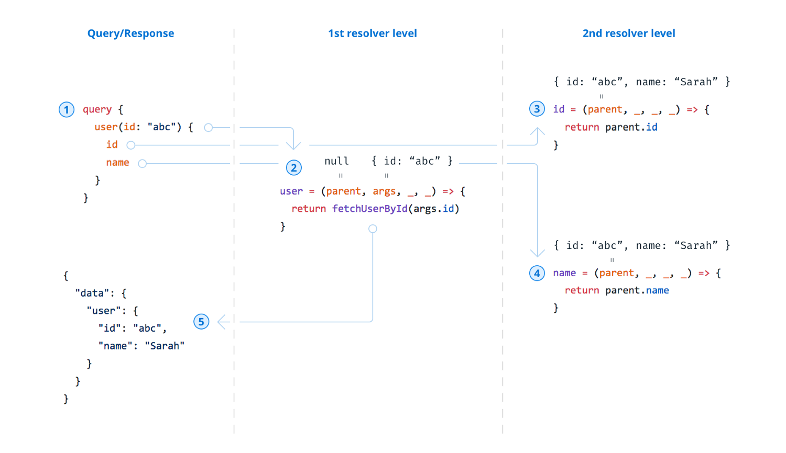

## GraphQL

* [graphql-unfriendly use cases](#graphql-unfriendly-use-cases)
* [Query Resolver](#query-resolver)
* [GraphQL middleware jobs](#graphql-middleware-role)
* [N+1 problem](#n+1-problem)
* [Resolver Deisgn](#resolver-design)
* [Custom Scalar Type](#custom-scalar-type)
* [Pass vars to mutation/query in playground](#pass-vars-in-playground)

### Graphql-unfriendly use cases
Weigh up the usage of graphql when dealing with below use cases:

* Recurisve data - tree-structure menu with any depth
* Arbitrary data - free-form data i.e arbitrary values contained object

### Query Resolver


A few things to note
* Root field (user) resolver will have parent `null` since it is the first resolver
* `parent` argument in the 2nd resolvers will be `{id: 'abc', name: 'Sarah'}` which is returned from 1st resolver
* Step 3 and 4 happen in parallel
* No need for fields id and name to have resolvers, since they are really easy to be inferred by `GraphQL.js`
* If a field is another type, then the resolver for that type will be run to resolve it until the scalar type is finally reached
* GraphQL server has a default resolver will look in root to find a property with the same name as the field. So you don't have to specify resolvers for every single filed:

```graphql
query user {
  user {
    name # don't need a resolver and default resolver will find out what needs to return by looking at root - which is user object containing name field
  }
}
```

### Graphql Middleware Role
Graphql middleware like `apollo-server-restify` basically does two things:
* Ensure `queries` and `mutations` included in the body of incoming POST requests can be executed by `GraphQL.js`.
It needs to parse out the query and forward it to the `graphql` function for execution.
* Attach the result of operations to the response object to be returned to the client.

### N+1 Problem
Say you have schema and resolvers as follow:

```graphql
type User {
  id: ID
  address: Address
}
type Address {
  id: ID
  street: String
  city: String
}
```

```graphql
const resolvers = {
  query: {
    allUsers: (root) => {
      return db.users.all()
    }
  },
  User: {
    address: (user) => {
      return db.addresses.fromId(user.addressId)
    }
  }
}
```

And you query like this:

```graphql
query getUserList {
  allUsers {         # Fetch N users
    id
    address {        # Another 1 query to fetch address for each one of N users
      id
      street
    }
  }
}
```

As you would expect, `User.address` resolver is executed `N` times resulting in multiple access to data store!!!

### Resolver Design
Don't do this:
```graphql
export default {
  Query: {
    event: async (root, { id }) => await getEvent(id)
  },
  Event: {
    attendees: async (root, { id }) => await getAttendeesFromEvent(id)
  }
}
```
Do this:
```graphql
export default {
  Query: {
    event: (root, { id }) => ({ id })
  },
  Event: {
    title: async ({ id }) => {
      const {title} = await getEvent(id);
    },
    attendees: async ({ id }) => await getAttendeesFromEvent(id)
  }
}
```
The problem with first design is you still need to fetch entire event object even though users only ask for event attendees. i.e
```graphql
{
  event(id: "xxx") {
    attendees
  }
}
```

### Custom Scalar Type
```js
// First, create a new scalar type
const Image = new GraphQLScalarType({
  name: "Image",
  description: "An Image Scalar",
  serialize: value => isImage(value),
  parseLiteral: (ast) => {},
  parseValue: (value) => value
});

// Second, define it in resolver
const resolvers = {
  Image: Image,
  Query: {
    image: () =>
      "https://uploads.codesandbox.io/uploads/user/8d35d7c1-eecb-4aad-87b0-c22d30d12081/l2nh-cat.jpeg",
    notImage: () => "https://codesandbox.io/s/4qlo54l7k9"
  }
};

// third, use it!
const schemaString = `
  scalar Image
  
  type Query {
    image: Image,
    notImage: Image
  }
`;

const jsSchema = makeExecutableSchema({
  typeDefs: schemaString,
  resolvers: resolvers,
});
```
  * `serialize` - called when the value of the type is going to be sent to the client as a response.
  * `parseLiteral` - called when reading input from inline:
    ```graphql
    query {
        allUsers(first:10) {
            id
        }
    }
    ```
    Input value will be transformed to AST which is then served as input to the function. Parsed value needs to be returned as a result.
  * `parseValue` - called when input value is fed through JSON:    
      ```graphql
      query ($howMany: YourCustomType) {
        users(first: $howMany) {
          id
        }
      }

      // vars
      {
        "howMany": {
          "thisMany": 10
        }
      }
      ```
      Function gets the input as JSON and returns whatever the query resolver should use.

Basically, you need to implement both methods in order for input to be correctly retrieved.
[Create custom GraphQL types](https://medium.com/yld-engineering-blog/create-custom-graphql-types-999f009d3f46)

### Pass vars in playground
```graphql
mutation addNavMenu($input: createNavMenuInput! ) {
  putNavMenu(input: $input ) {
    message
  }
}
```
vars
```graphql
{
  "input": {
      "navMenu": [
        { "id": "me1", "title": "Menu Expander 1" },
        { "id": "me2", "title": "Menu Expander 2" }
      ],
    "profileId": "789"
  }
}
```


