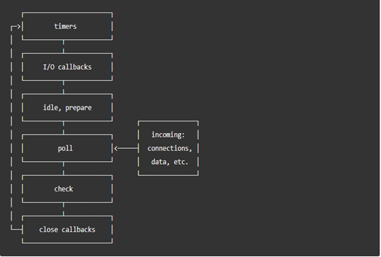

## Event Loop and V8 Engine




### Key Notes
* A task (message + callback) will be added to the task queue once something below happens
```js
emitter1.on('EVENT_NAME', callback);
```
* In any specific phase, event loop will pick the oldest from the queue and push its callback to stack to run which in return creates a frame.
  * Stack is FILO.
  * A frame contains the function call and its arguments, local variables.
  * Frame will be popped out once it's finished execution
  * Event loop will take next task in the queue and go through the same operation process again until either task queue is empty or max   number of callbacks has been executed. When these happen, the event loop will move to the next phase, and so on.
  * Each phase has a FIFO queue of callbacks to execute  
* When blocking happens i.e long running operation in sync function call event loop will be completely blocked and will do nothing at all except wait until the operation finishes.
