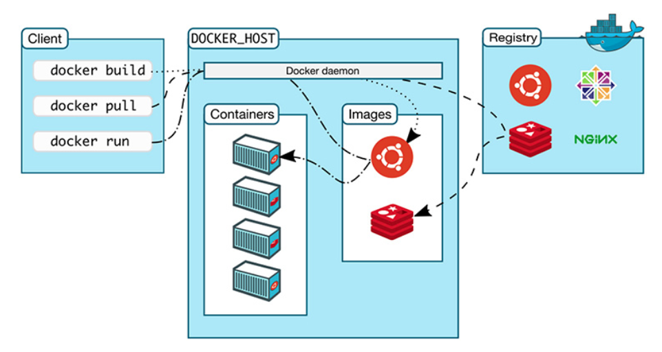
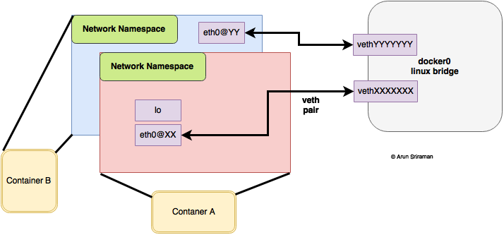

## Docker

* Docker
  * [Architecture](#Architecture)
  * [Dockerfile](#dockerfile)
  * [Enter running container](#Enter-running-container)
  * [Logging](#Logging)
  * [Copy files](#Copy-files)
  * [Delete dangling images](#Delete-dangling-images)
  * [Networking](#Networking)
* Docker Compose
  * [Mount your code as a volume to avoid image rebuilds](#Mount-src-to-volume)
  * [Use hostnames to connect to containers](#Use-host-as-ref)

### Architecture


### dockerfile
Each instruction in `Dockerfile` composes one layer of final image. More layers more complex. So try to group instructions.

Docker images are layered. When you build a new image, Docker does this for each instruction (RUN, COPY etc.) in your Dockerfile:

* Create a temporary container from the previous image layer (or the base FROM image for the first command
* Run the Dockerfile instruction in the temporary `intermediate` container
* Save the temporary container as a new image layer

#### ARGS vs ENV


* Keep it in mind that this is not shell script you should try to write as less lines of intructions as possible.
* Remember to remove/clean up redundant files you've created during build/setup to reduce image footprint.
* Each line of instruction should only do things relating to that layer.

#### ENTRYPOINT VS CMD
The ENTRYPOINT specifies a command that will always be executed when the container starts, by default it is `/bin/sh -c`.
The CMD specifies arguments that will be fed to the ENTRYPOINT.

If you want to make an image dedicated to a specific command you will use `ENTRYPOINT ["/path/dedicated_command"]`. Otherwise, if you want to make an image for general purpose, you can leave **ENTRYPOINT** unspecified and use `CMD ["/path/dedicated_command"]` as you will be able to override the setting by supplying arguments to docker run.

### Networking
The Docker server creates and configures the host system’s **docker0** interface as an Ethernet bridge inside the Linux kernel that could be used by the docker containers to communicate with each other and with the outside world.

When docker engine is started, the default bridge network named **docker0** is created - not visible on Mac via ifconfig since it’s in VM.

Docker bridge network:




As shown above, **docker0** bridge is virtual interface created by docker, it randomly chooses an address and subnet from the private range that are not in use on the host machine, and assigns it to **docker0**. By default, all the docker containers will be connected to the **docker0 bridge**, the docker containers connnected to the **docker0 bridge** could use the **iptables NAT rules** created by docker to communicate with the outside world.

Bridge network provides isolations that containers sitting outside the default bridge network (custom one) cannot communicate with ones sitting inside.

Containers connected to the default bridge network can communicate, but **ONLY by IP address**, unless they are linked using the `legacy--link flag`.

Docker network drivers utilize **veths** to provide explicit connections between namespaces when Docker networks are created. When a container is attached to a Docker network, one end of the veth is placed inside the container (usually seen as the ethX interface) while the other is attached to the Docker network (bridge network). See [Virtual Ethernet Devices](https://github.com/DavidHe1127/Mr.He_HandBook/blob/master/cloud/linux.md#networking)

### Mount src to volume
Any time you make a change to your code, you need to rebuild your Docker image (which is a manual step and can be time consuming). To solve this issue, mount your code as a volume. Now manual rebuilds are no longer necessary when code is changed.

```yml
services:
  web:
    volumes:
      - ./webapp:/opt/webapp
```

### Use host as ref
By default Compose sets up a single network for your app. When you name a service in your Compose YAML, it creates a hostname that you can then use to connect to the service.

```yml
services:
  web:
  redis:
  db:
```

```js
postgres://db:5432
redis://redis:6379
```

### Enter running container
```bash
docker exec -it <CONTAINER_ID> /bin/bash
```
or this if it's alpine-based container
```bash
docker exec -it --rm <IMAGE_ID/TAG> /bin/ash
```

### Logging
To pull out a cranshed/stopped container logs, you can do:
```shell
$ docker ps -a // get container id. it prints out all containers infor default is running ones only
$ docker logs <CONTAINER_ID>
```
To see logs printed in real-time while running your container, you can do:
```shell
$ docker exec -ip 3000:3000 serverless
```

### Copy files
Use `COPY` command in `Dockerfile` when copying files to **image**, Use `docker cp` while copying files in/out of a **container**. Container basically implies it's running.

### Delete dangling images
To remove images such as `<none>:<none>`, run command below:

`$ docker rmi -f $(docker images -f "dangling=true" -q)`
