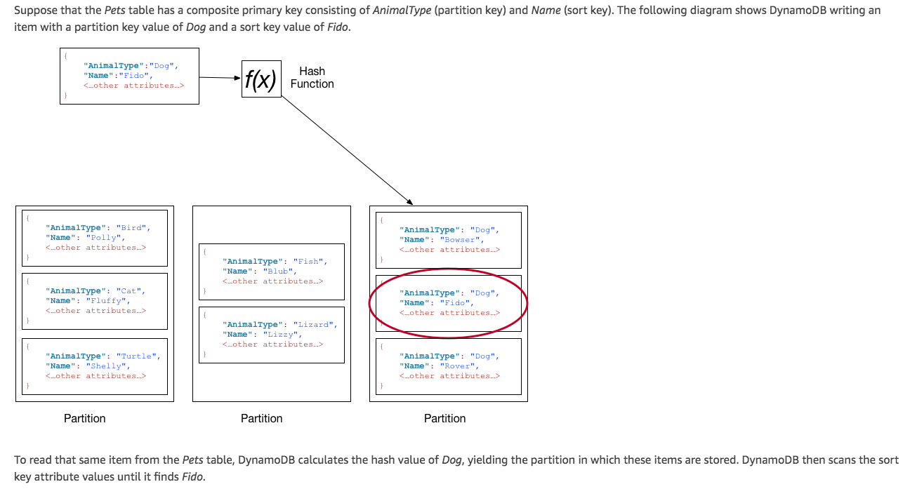
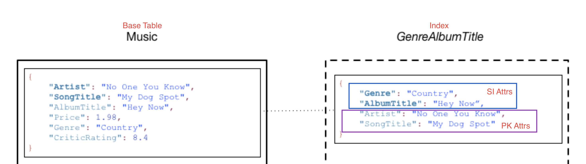
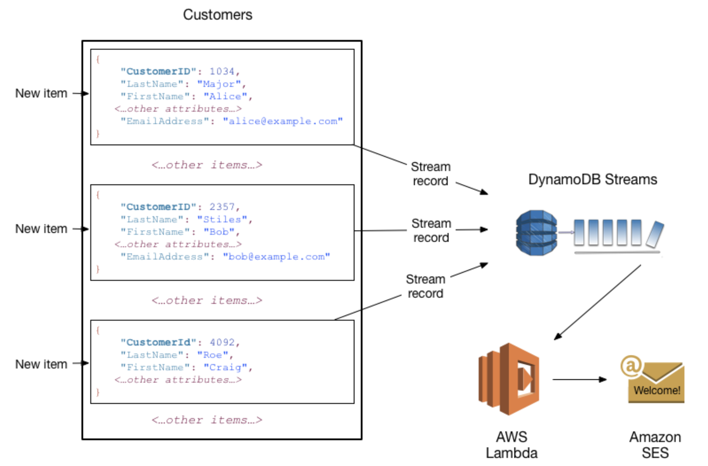

## DynamoDB key points

* [Core Concept](#core-concept)
 * [Primary Key](#primary-key)
 * [Secondary Indexs](#secondary-index)
 * [Streams](#streams)
 * [Caveats](#caveats)

### core-concept

#### partition

* An allocation of storage for a table backed by SSD and auto replicated across multiple AZs within a region
* AWS allocates additional partitions when:
  * If you increase the table's provisioned throughput settings beyond what the existing partitions can support.
  * If an existing partition fills to capacity and more storage space is required.
* GSI in DynamoDB are also composed of partitions.
* When writing data, partition key will be used to determine which partition the data will be stored.
* When reading data, partition key will be used to determine which partition the data can be found.
* Choose a partition key that can have a large number of distinct values relative to the number of items in the table.
* Items with the same partition key value are stored physically close together, ordered by sort key value.

#### primary-key

* Only key-related attributes need to be defined beforehand. No need put non-key attributes in definition. i.e cloudformation template.
* Primary Key
  * **Partition key (hash attribute)** - DynamoDB uses the partition key's value as input to an internal hash function.
                    The output determins the partion in which the item will be stored. It's type must be scalar and can only hold one value - string, number or binary.
  * **Partition key + sort key (range attribute)** - AKA `composite primary key`. Comprised of two attributes - partition key attr + sort key attr.
                               `Partition key` determines where data is stored whereas `sort key` determines sorted order.
                               For tables with composite primary key, partition key can be the same but sort key must be different.

#### secondary-index

* Provide more querying flexibility
* Allow 1 or more SI on a table
* Allow query data using an alternate key in addition to queries against the PK
* GSI
  * An index with a partition key and sort key that can be different from those on the table. Max no. on a table - 20
  * **Must** have a partition key and can have a sort key.
  * Cannot fetch attributes from base table! Make sure you choose the right projected attributes.
  * Key attributes projected automatically.
* LSI
  * An index that has the **same** partition key as the table, but a different sort key. Max no. on a table - 5
  * Key attributes projected automatically.
  * Can fetch from base table for non-projected attributes in index at a greater latency and with higher provisioned throughput costs.
   

   At a minimum, DynamoDB projects the key attributes from base table into the index.

#### Streams

#### Caveats
* `Query` requires partition key to be provided. Sort key is optional. While `Get` requires you provide both partition key and sort key.
