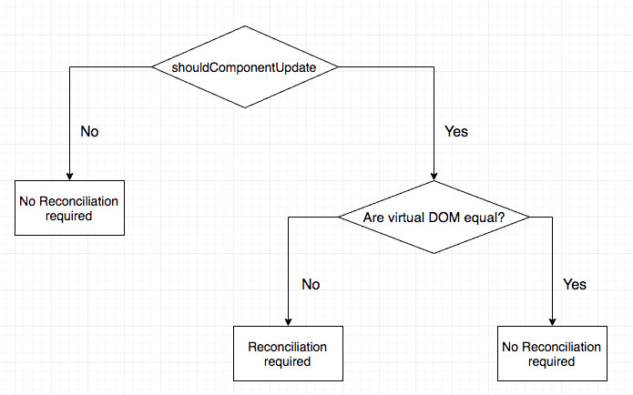

## React Essentials and Tips

* [How react works](#how-react-works)
* [Why use PropTypes](#why-use-proptypes)
* [Component VS Element](#component-vs-element)
* [Event Listeners](#event-listeners)
* [Lifecycle Event Hooks](#lifecycle-hooks)
* [Smart vs Dumb Components](#smart-vs-dumb)
* [Prevent unncessary re-rendering](#prevent-unncessary-rerendering)
* [Why need keys](#why-need-keys)
* [Controlled vs uncontrolled components](#controlled-vs-uncontrolled)
* [Async setState](#async-setstate)

### how-react-works
Every time `state` or `prop` changes in component, process below happens
* React will re-render your UI with updated `state` or `prop` to a virtual DOM representation.
* React then smartly calculates the difference between the two virtual DOM (current state vs previous state)
* The resulting difference will be applied to real DOM to reflect changes. Note, React updates only what needs to be updated in the
  real DOM


### why-use-proptypes
Use `propTypes` on all occasions - You can use it to document your components. You no longer need to look around the source code of the `render` method to figure out what properties needs to be provided.

### component-vs-element
* React element is an object representation of a DOM node and its properties
* A component is a function or a Class which optionally accepts input and returns a React element.

### lifecycle-hooks

|Initialization   |Mounting           |State or Props updating  |Unmounting|
| -------- |:---------------:|:---------------:| --------:|
|getDefaultProps   |constructor|componentWillReceiveProps(props update only)|componentWillUnmount
|getInitialState   |componentWillMount|shouldComponentUpdate|
|                  |componentDidMount|componentWillUpdate|
|                  |                  |render|
|                  |                  |componentDidUpdate|

Init
---
`getDefaultProps` - set default props if parents not pass it down

Mounting
---
`constructor` - initialize `states`
`componentWillMount` - setState will not re-render
`componentDidMount` - fetch data

Updating
---
`componentWillReceiveProps` - setState will not trigger additional re-render / place to access old props
`shouldComponentUpdate` - return true/false def true. if false methods below won't be called - see example below
`componentWillUpdate` - DO NOT use setState()
`render`
`componentDidUpdate`  - updated DOM interactions and post-render actions go here. **NO setState otherwise it might cause infinite loop**


### smart-vs-dumb
It is a common best practice to create several stateless components that just render data, and have a stateful component wrapping them that passes its state to the children via props. This way you can encapsulate all the interaction logic in one place — the stateful component — , while the stateless components take care of rendering data in a declarative way.

### event-listeners
React doesn’t actually attach event handlers to the nodes themselves, instead when React starts up, it starts listening for all events at the top level using a single event listener, and when your component is mounted the event handlers are added to an internal mapping. Then when an event occurs, React knows how to dispatch it using this mapping. When your component is unmounted the event handlers are removed from the internal mapping so you don’t need to worry about memory leaks.

|Initialization   |Mounting           |State or Props updating  |Unmounting|
| -------- |:---------------:|:---------------:| --------:|
|getDefaultProps   |componentWillMount|componentWillReceiveProps(props update only)|componentWillUnmount
|getInitialState   |componentDidMount |shouldComponentUpdate|
|                  |                  |componentWillUpdate|
|                  |                  |render|
|                  |                  |componentDidUpdate|

##### Init
`getDefaultProps` - set default props if parents not pass it down

##### Mounting
`componentWillMount` - setState will not re-render
`componentDidMount` - fetch data

##### Updating
`componentWillReceiveProps` - setState will not trigger additional re-render / place to access old props
`shouldComponentUpdate` - return true/false def true. if false methods below won't be called - see example below
`componentWillUpdate` - DO NOT use setState()
`render`
`componentDidUpdate`  - updated DOM interactions and post-render actions go here. **NO setState otherwise it might cause infinite loop**

##### Unmounting
`componentWillUnmount` - invalidate timers

**NOTE, Try to avoid using these lifecycle events hooks as less as possible**

### prevent-unncessary-rerendering
Reconciliation is the process that React uses algorithm to diff one tree with another to determine which parts need to be changed.
The only way to prevent re-rendering happening is explicitly call `shouldComponentUpdate` and return `false`. 

```js
var TextComponent = React.createClass({
    shouldComponentUpdate: function(nextProps, nextState) {
    // whenever parent passes down 'text' and it is equal to current 'text' no re-render
        if (this.props.text === nextProps.text) return false;
        return true;
    },

    render: function() {
        return <textarea value={this.props.text} />;
    }
});
```


`shouldComponentUpdate` happens before React update process. Both parent and its children components will not bother computing the difference if parent's `shouldComponentUpdate` returns false.
`React.PureComponent` does *shallow comparison* on all `props` and `states` by default.
React uses `shallow-comparison` to work out if `state` or `prop` is changed. `shallow-comparion` only compares the value for primitive types or reference for reference types. Hence, code below should be avoided since component B always re-renders even though `onChange` is not changed.
```js
// Component A
...
render () {
  <B onChange={this.onChange.bind()} />
}

// Component B
class B extends React.PureComponent { // NOT HELP!!! a different onChange passed to it on every render
  render () {
    <div>
      <input onChange={this.props.onChange} />
    </div>
  }
}
```

### why-need-keys
It is for react to determine what component in the list has changed. Use `shortid` as keys rather than `index` in the array. Using `index` as keys leads to performance issue when you
* Add new elements to the front
* Sort the list

For more details, read [Why need keys](https://paulgray.net/keys-in-react/?utm_source=reactnl&utm_medium=email)

### controlled-vs-uncontrolled
In a nutshell, Uncontrolled - Use `ref` to reference the component and get the value. While on the other hand, controlled means you access the component from the callback.

For more details - read [Controlled vs Uncontrolled form inputs](https://goshakkk.name/controlled-vs-uncontrolled-inputs-react/)

### async-setstate
`setState` is async and will batch updates. If you do something in the `setState` callback, then it will be triggered last. See flow below.

**setState => render with new state => componentDidUpdate => setState callback**


