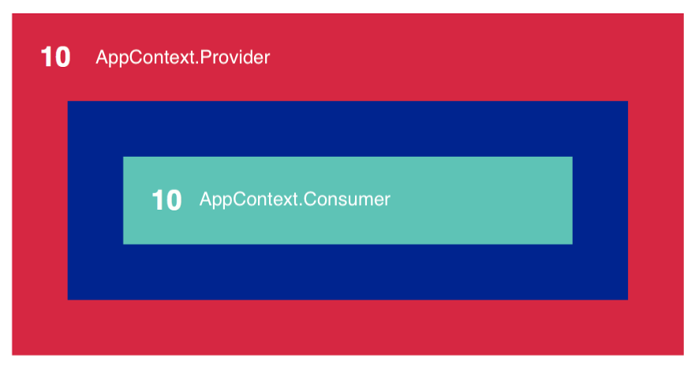

New Context APIs



```js
const AppContext = React.createContext()
class AppProvider extends Component {
  state = {
    number : 10
  }
render() {
    return <AppContext.Provider value={this.state}>
      {this.props.children}
    </AppContext.Provider>
  }
}

const Green = () => (
  <div className="green">
      <AppContext.Consumer>
        {(context) => context.number}
      </AppContext.Consumer>
  </div>
)

// or use useContext
const Green = () => {
  const value = useContext(AppContext);
  return (<div className="green">
    {value.number}
  </div>
  )
}


const Blue = () => (
  <div className="blue">
    <Green />
  </div>
)
 
class Red extends Component {
  render() {
    return  <AppProvider> 
        <div className="red">
          <AppContext.Consumer>
            {(context) => context.number}
          </AppContext.Consumer>
          <Blue />
        </div>
    </AppProvider>
  }
}
```

[Original link](https://hackernoon.com/how-to-use-the-new-react-context-api-fce011e7d87)
