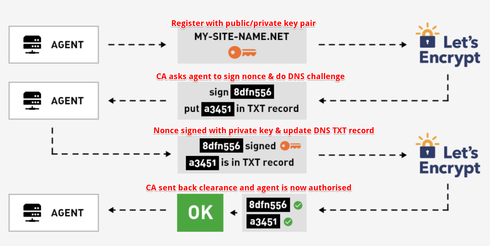

## Cert

* [SSL Cert with Let's encrypt](#Ssl-cert-with-lets-encrypt)

### Ssl cert with Let's encrypt

* The objective of Let’s Encrypt and the ACME protocol is to make it possible to set up an HTTPS server and have it automatically obtain a browser-trusted certificate, without any human intervention. This is accomplished by running a certificate management agent on the web server.
* There are two steps to this process. First, the agent proves to the CA that the web server controls a domain (DNS challenge). Then, the agent can request, renew, and revoke certificates for that domain.

