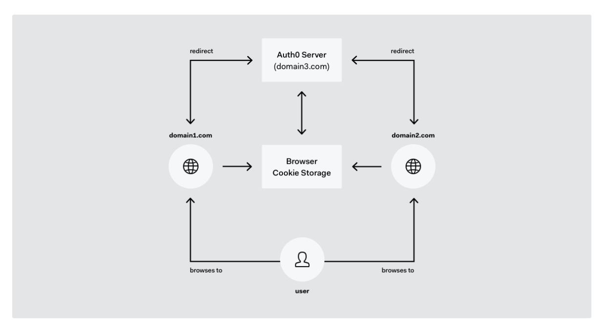

* [What is SSO and how it works](https://auth0.com/blog/what-is-and-how-does-single-sign-on-work/)
* [keypoints](#keypoints)

### keypoints
* Users will be redirected to `Auth` server to be able to authenticate every time they visit different subdomains.
* When an user sign into `abc.domain.com`, `Auth` server will generate a login cookie alongside the redirect url to send back to the client.
* Anytime later, when the same user visits `def.domain.com`, the user will be redirected to the `Auth` server first, server will provide the user with earlier-generated url including login cookie. So, this user does not need to sign in again.

