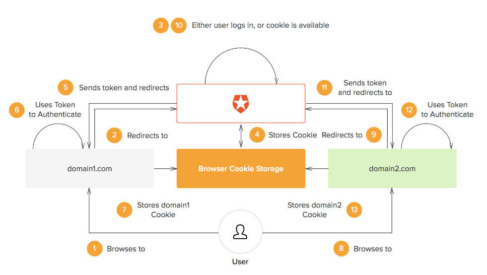

* [What is SSO and how it works](https://auth0.com/blog/what-is-and-how-does-single-sign-on-work/)
* [keypoints](#keypoints)

### keypoints
* Users will always be redirected to `Auth` server where sent `cookie` will be checked to determine whether or not users need to authenticate or redirect.
* In case of unauthenticated visists When they are visiting `abc.domain.com`, `Auth` server will generate `token` alongside the redirect url to send back to the client. `token` is then used to authenticate subsequent api calls.
* In case of authentication when the same user visits `def.domain.com`, `Auth` server will provide the user with earlier-generated url including auth token. So, this user does not need to sign in again.
* A `cookie` will be set in the response header to later be used to determine users authentication status.

